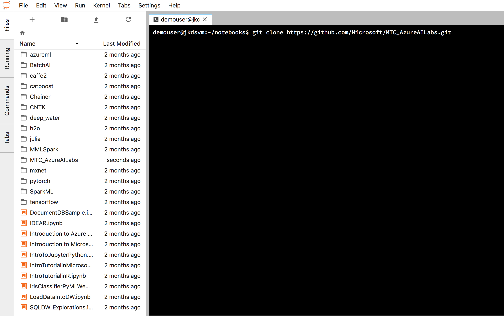

# Environment setup

The lab consists of 3 exercises:
1. Training a custom image classifier
2. Consuming a prediction endpoint
3. Exporting a classifier as a docker image

To complete the first exercise you will use Custom Vision Service web GUI. In the second and third exercises you will use Custom Vision Service Python SDK and Jupyter notebooks.

Although you can install all pre-requisities required to complete the lab on your workstation, we will utilize Azure Data Science Virtual Machine (DSVM). DSVM comes with most of the pre-requisites pre-installed, which will make lab environment setup faster and easier.

## Provision and configure Azure DSVM

You will use Azure Portal to provision Azure DSVM. 

1. Navigate and log in to Azure Portal

https://portal.azure.com

2. Click on **Create a resource** in the top left corner

3. Enter *Data Science Virtual Machine* in the search text box

4. Select *Data Science Virtual Machine for Linux (Ubuntu)*

5. Configure DSVM:
  - Use password rather than SSH key for authentication
  - Use *Standard SSD*
  - Create a new resource group
  - Use *D4s_V3* or similar for the VM type
  - Leave all other parameters at default values
  
6. DSVM comes preconfigured with Jupyter Notebook and Jupyter Lab. You will use Jupyter Lab. After your DSVM is ready, navigate to the below URL. Your browser may complain abouth an invalid certificate - ignore the warnings and proceed to log in using the credentials you created during the VM setup. 

https://https://your-vm-ip:8000/user/your-username/lab.

7. Your instructor will explain key elements of the Jupyter Lab interface and show you how to clone the lab's repo using the Jupyter Lab's terminal window. Make sure to clone the repos under the *Notebooks* folder in your home directory.

  

## Create Custom Vision Service Project
You will now create a Custom Vision Service project. You can do it using Azure Portal, Custom Vision Service SDK, or Custom Vision Service web GUI. The following steps demonstrate how to provision the project using CVS web GUI.

1. Navigate to Custom Vision Service web GUI at:

https://customvision.ai

2. Login using your Azure account. You should see the screen similar to the one below:

3. Click on *New Project* to add a new project and set the project's name and description

4. Configure a new resource group for your project's resources. 

5. Configure the remaining parameters. Make sure to select *Classification* for *Project Types*, *Multiclass* for *Classification Types*, and *General* for *Domains*.

Congratulations. Your environment is ready.

[Next Step](https://github.com/Microsoft/MTC_AzureAILabs/tree/master/Lab01%20-%20Image%20Classification%20with%20Custom%20Vision%20Service/Step2-Train)
