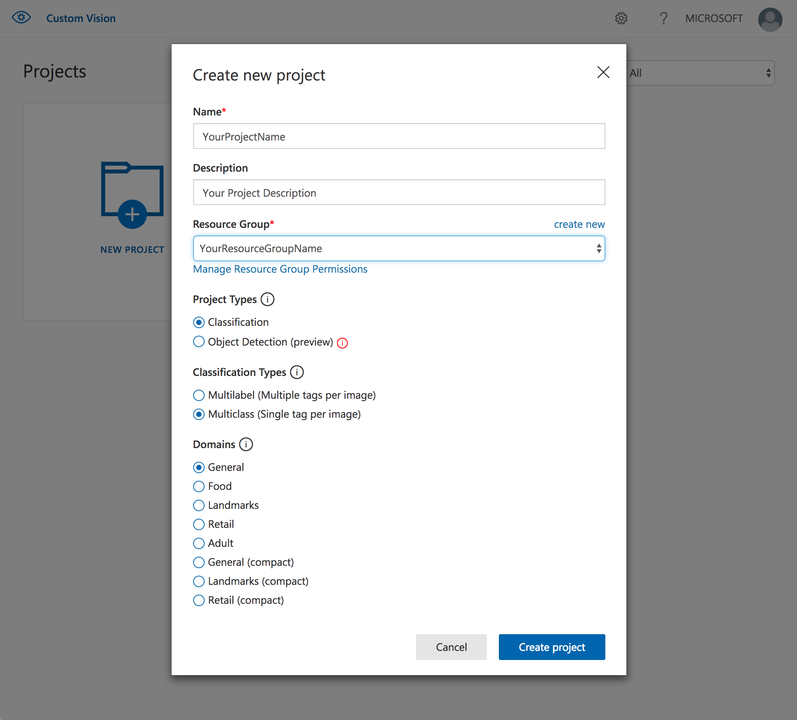

# Environment setup

The lab consists of 3 exercises:
1. Training a custom image classifier
2. Consuming a prediction endpoint
3. Exporting a classifier as a docker image

To complete the first exercise you will use Custom Vision Service web GUI. In the second and third exercises you will primarly use Custom Vision Service Python SDK and Jupyter notebooks.

Although you can install all pre-requisities required to complete the second and third exercises on your workstation, we will utilize Azure Data Science Virtual Machine (DSVM). DSVM comes with most of the pre-requisites pre-installed, which will make lab environment setup faster and easier.

## Provision and configure Azure DSVM

You will use Azure Portal to provision Azure DSVM. 

1. Navigate and log in to Azure Portal

https://portal.azure.com

2. Click on **Create a resource** in the top left corner

3. Enter *Data Science Virtual Machine* in the search text box


4. Select *Data Science Virtual Machine for Linux (Ubuntu)*

5. Configure DSVM:
  - Use password rather than SSH key for authentication
  - Use *Standard SSD*
  - Create a new resource group
  - Use *D4s_V3* or similar for the VM type
  - Leave all other parameters at default values
  
6. We will use Jupyter Lab. After your DSVM is ready navigate to the below URL. 

https://https://your-vm-ip:8000/user/your-username/lab.


  


## Create Custom Vision Service Project

1. Navigate to Custom Vision Service web GUI at:

https://customvision.ai

2. Login using your Azure account. You should see the screen similar to the one below:


3. Click on *New Project* to add a new project and set the project's name and description

4. Configure a new resource group for your project's resources. 


5. Configure the remaining parameters. Make sure to select *Classification* for *Project Types*, *Multiclass* for *Classification Types*, and *General* for *Domains*.




## Install Custom Vision Service SDK
As indicated in the lab's prerequisities, you should have Anaconda for Python 3 pre-installed. If you don't, now is the time.
You can install the SDK in the existing `conda` environment (including the default one) or if you prefer you can create a new `conda` environment. 

If you prefer to create the new environment follow this steps:

On MacOS/Linux:

```
conda create -n <YourEnvName> anaconda
source activate <YourEnvName>
```

On Windows:

```
conda create -n <YourEnvName>
activate <YourEnvName>
```

Ton install Custom Vision SDK

```
pip install azure-cognitiveservices-vision-customvision
```

## Clone the workshop's repo
Clone the AzureAILabs repo in your preferred location
```
git clone https://github.com/Microsoft/MTC_AzureAILabs.git
```

## Verify that you can start and connect to Jupyter Lab 
Start Jupyter Lab from the root folder of the lab 
```
cd <MTC_AzureAILabs root>
jupyter lab
```
Connect to Jupyter Lab
Verify that you can see this screen


Press `Ctrl-C` to kill the Jupyter session.

Congratulations. Your environment is ready.

[Next Step](https://github.com/Microsoft/MTC_AzureAILabs/tree/master/Lab01%20-%20Image%20Classification%20with%20Custom%20Vision%20Service/Step2-Train)
