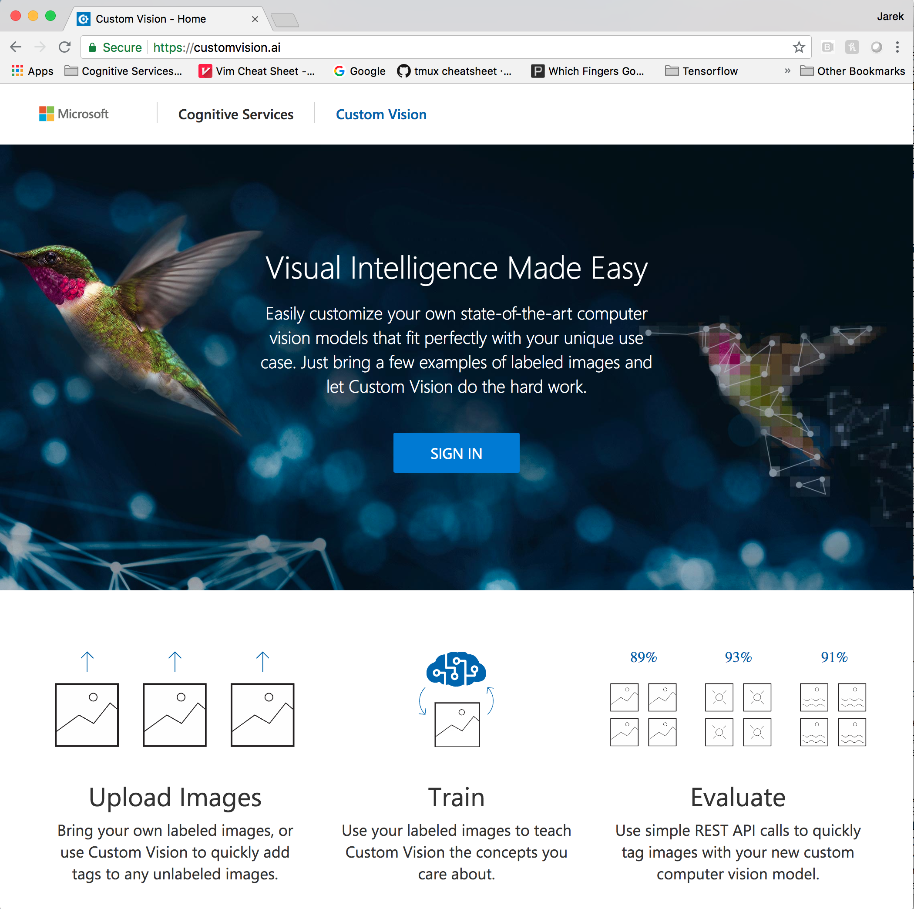
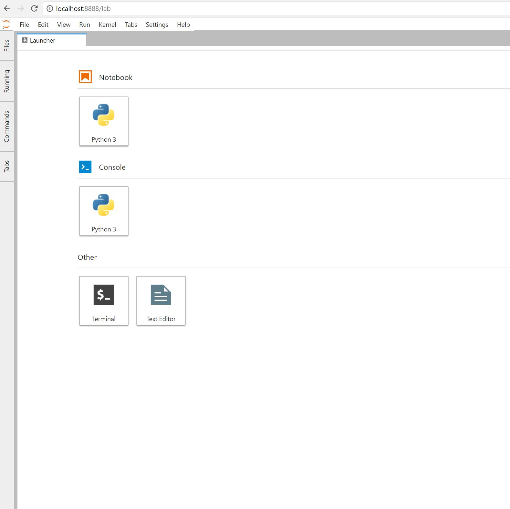

# Environment setup

In this step you will prepare the lab environment, including Custom Vision Service project and Custom Vision Service SDK. 

## Create Custom Vision Service Project

1. Navigate to Custom Vision portal at:

https://customvision.ai

2. Login using your Azure account. You should see the screen similar to the one below:



3. Click on *New Project* to add a new project


4. Set the project's name and description.

5. Create a new resource group for your project's resources.

![Step 3][images/img3.PNG)


## Install Custom Vision SDK
As indicated in the workshop prerequisities you should have Anaconda for Python 3 pre-installed. If you don't, know is the time.
If you prefer you can create `conda` environment to run the SDK in a sandbox.

```
pip install azure-cognitiveservices-vision-customvision
```

## Clone the workshop's repo
Clone the workshop's repo in your preferred location
```
git clone https://github.com/jarokaz/CognitiveServicesWorkshop.git
```

## Verify that you can start and connect to Jupyter Lab 
Start Jupyter Lab from the root folder of the workshop's repo
```
jupyter lab
```
Connect to Jupyter Lab
Verify that you can see this screen



Press `Ctrl-C` to kill the Jupyter session.

Congratulations. Your environment is ready.


